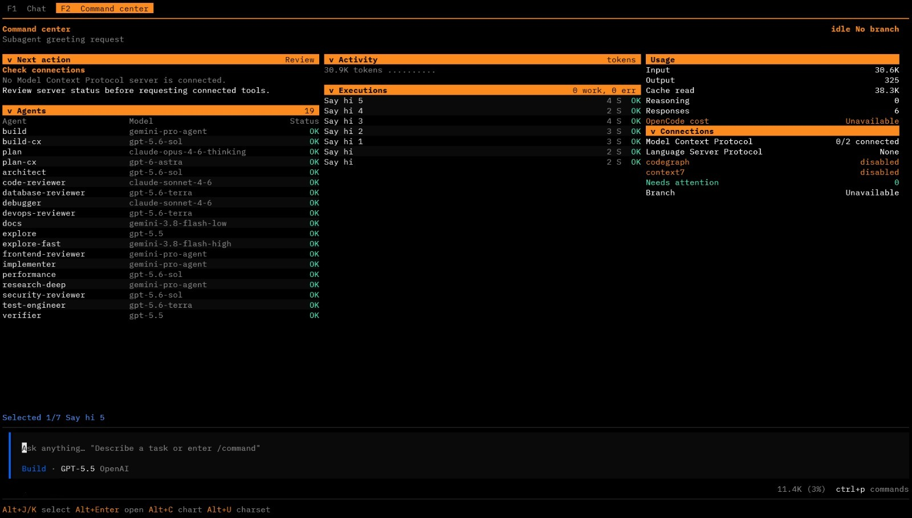
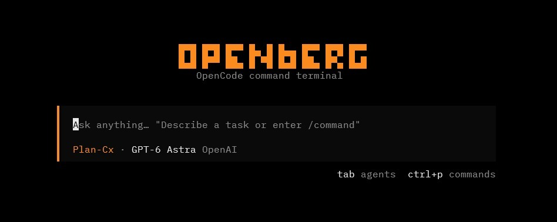
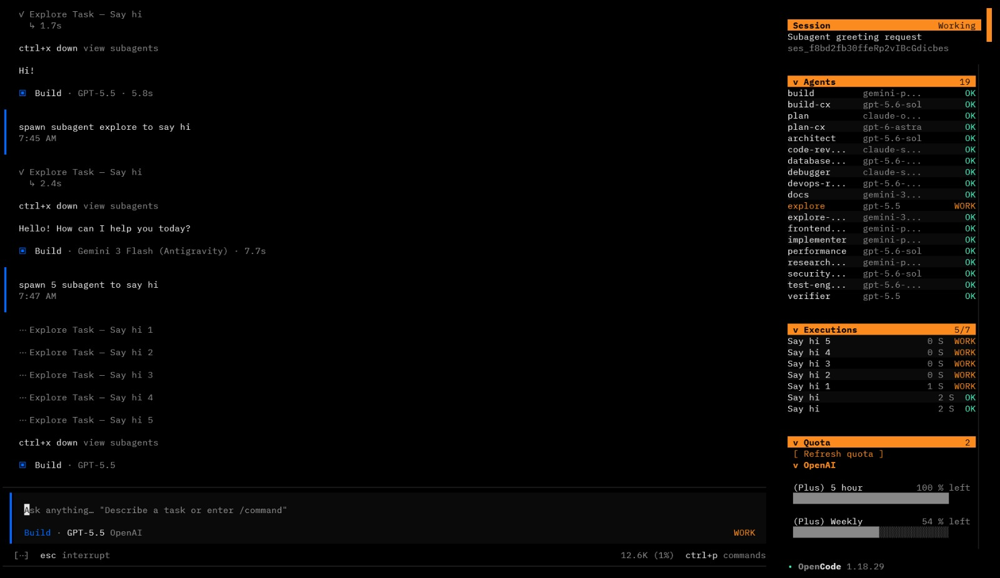
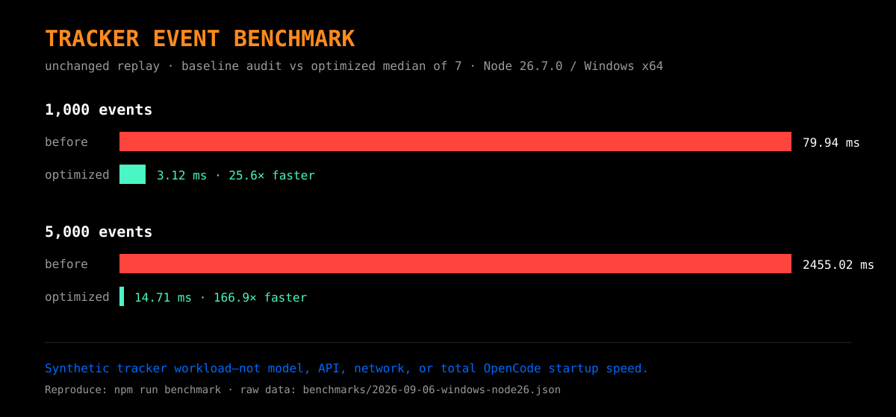
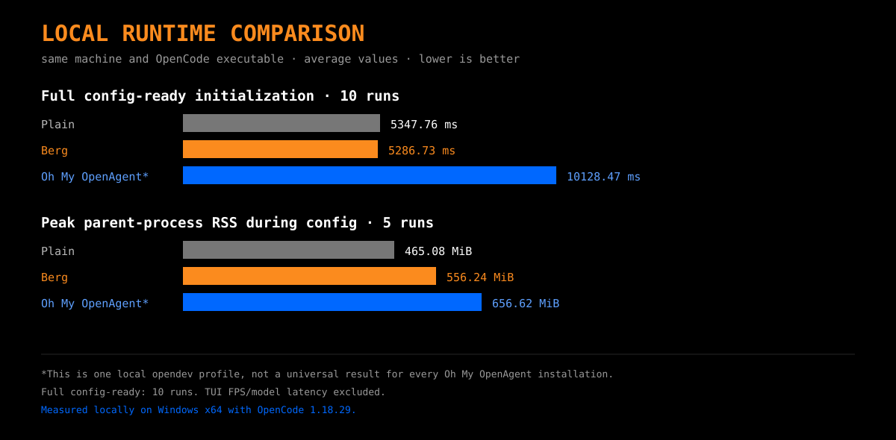

<p align="center">
  
</p>

An open-source **TUI plugin and theme for OpenCode**. Berg adds a responsive command center, realtime agent/execution tracking, usage telemetry, connection status, and opt-in quota monitoring without replacing OpenCode's model runtime.

> `F2` opens the command center. `F1` returns to chat.



## Why Berg?

| Area | Plain OpenCode | OpenCode + Berg |
|---|---|---|
| Chat | Native chat | Native chat remains intact |
| Agent visibility | Conversation flow | Dedicated realtime Agents panel |
| Delegated work | Child sessions in chat | Executions panel with title, duration, status, and navigation |
| Operations | Native views | Responsive command center with activity, usage, connections, branch, and next action |
| Quota | Provider-specific | Masked multi-account view, loaded only after an explicit click |
| Theme | Built-in themes | Black canvas, Berg orange headers, and semantic status colors |

Berg does not change model or network latency. Its performance goal is to keep the added UI overhead small and predictable.

## Screenshots

| New chat | Realtime processing |
|---|---|
|  |  |

## Performance

### Berg before vs optimized Berg

| Internal Berg workload | Before | Optimized |
|---|---:|---:|
| Automatic quota requests at panel mount | Up to 2 | **0** |
| Full-history reconciliation | 60/min | **4/min** |
| 1,000 unchanged task events | 79.94 ms | **3.12 ms** |
| 5,000 unchanged task events | 2,455.02 ms | **14.71 ms** |



This synthetic benchmark isolates Berg's execution tracker. It does not measure model, API, network, or total OpenCode speed.

### Local runtime comparison

Measured on Windows x64 with OpenCode 1.18.29. Every mode used the same OpenCode executable. Plain OpenCode used the same main config with only the Berg TUI plugin/theme disabled.

| Measurement | Plain OpenCode | Berg | Oh My OpenAgent* |
|---|---:|---:|---:|
| Full config-ready average, 10 runs | 5,347.76 ms | **5,286.73 ms** | 10,128.47 ms |
| Full config-ready median, 10 runs | 5,222.85 ms | **5,247.69 ms** | 8,369.59 ms |
| Peak parent-process RSS during config, 5 runs | 465.08 MiB | **556.24 MiB** | 656.62 MiB |



What the data supports:

- Quota and diagnostic filesystem modules are deferred until those opt-in features are used; this change was made after the recorded run and is not represented as a new benchmark result.
- Berg stayed close to plain OpenCode while adding its TUI features.
- For full config-ready initialization, Berg averaged **47.8% less time** than the tested Oh My OpenAgent profile; the median was **37.3% lower**.
- Berg used more memory than plain OpenCode in the config workload, but about 100 MiB less median peak RSS than the tested Oh My OpenAgent profile.
- The tested Oh My OpenAgent profile resolved 40 agents, 80 commands, 5 MCP entries, and 3 main plugins. The plain/Berg main profile resolved 18 agents, 0 main-config commands, 2 MCP entries, and 2 main plugins. Berg's TUI-only slots and keybindings are not counted there.

\* This is one local `opendev` profile, not a universal result for every Oh My OpenAgent version, machine, or configuration. The tested feature scopes differ.

## Privacy

- No API keys, OAuth tokens, refresh tokens, passwords, or user config are included in this repository.
- Berg does not read auth files or call quota endpoints at startup.
- **Load live quota** is explicit. Credentials are used in memory only against their matching provider endpoint and are never copied into Berg config or UI.
- Emails are masked.
- Diagnostics are disabled by default and redact sensitive fields when enabled with `BERG_TERMINAL_DIAGNOSTIC=1`.

## Requirements

- Node.js 22.18+ and npm 10+
- OpenCode with source TSX TUI plugin support

## Install

```bash
git clone <your-repository-url>
cd opencode-berg-terminal
npm install
node scripts/install.mjs # dry run
node scripts/install.mjs --apply
```

Restart OpenCode after installation. The installer preserves unrelated TUI settings and backs up an existing config before writing.

Manual `~/.config/opencode/tui.json` example:

```json
{
  "$schema": "https://opencode.ai/tui.json",
  "plugin": ["/absolute/path/to/opencode-berg-terminal/tui.tsx"],
  "theme": "berg-terminal"
}
```

Use forward slashes for Windows JSON paths.

## Add agents

Berg reads normal OpenCode agents. Agents may define a primary model, fallback models, and a custom system prompt:

```jsonc
{
  "$schema": "https://opencode.ai/config.json",
  "default_agent": "build",
  "agent": {
    "build": {
      "description": "Coordinates implementation work.",
      "mode": "primary",
      "model": "gpt-5.6-sol",
      "fallback_models": [
        "gpt-5.6-sol"
      ],
      "system": "You are the primary coding orchestrator. For non-trivial tasks, create and maintain TODOs. Inspect the existing code before changing it. Delegate proactively when useful. Run independent subagents in parallel when they do not depend on each other; avoid parallel edits to the same files or tightly coupled code. Use explore-fast for discovery, research-deep for broad investigation, implementer for scoped coding, debugger for hard bugs, database-reviewer for DB work, security-reviewer for security-sensitive changes, performance for scaling, frontend-reviewer for frontend, test-engineer for tests, architect for major design decisions, code-reviewer for significant changes, verifier for final requirement checks, devops-reviewer for CI/CD, deployment, containers, observability, and infrastructure, and docs for documentation. Integrate and verify subagent results yourself. Give every delegated task a clear goal, scope, and expected output. Run relevant tests, type checks, lint, or builds before completion when practical. Never claim validation passed unless it actually ran. Keep solutions scoped and avoid unnecessary complexity."
    },
    "reviewer": {
      "description": "Reviews focused implementation changes.",
      "mode": "subagent",
      "model": "gpt-5.6-sol"
    }
  }
}
```

Models are examples; replace them with provider/model IDs available in your OpenCode installation.

## Controls

- `F2`: command center
- `F1`: chat/home
- `Alt+J` / `Alt+K`: select execution
- `Alt+Enter`: open selected child session
- `Alt+C`: change activity metric
- `Alt+U`: toggle ASCII/Unicode charts

## Development

```bash
npm run typecheck
npm test
npm run benchmark
npm run doctor
```

MIT © 2026 Afrizal Yogi Pratama
